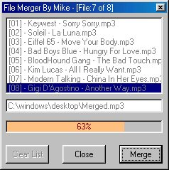



## Mike's File Merger \(Version 2\)

### Description

BUG: It put a extra byte at the end of the merge due to a mis-calculation, fixed it!! This is Version 2 from my last file merging submission which shelled 'copy' file commands to DOS which merged the files. Well as pathetic as that seemed, i was a lazy programmer and today i rewrote it from scratch to merge the files to one in binary in vb. This application will let you merge any type of file(s), one or more, into one big file. This will work with Almost all audio files (.mp3, .wav) and almost all Video files (.Avi, .Mpeg). Just think, merging all your favorite mp3s into one big file so you don't have to keep making playlists on your audio player and just think if you have a split up DiVX movie and want to put all of the parts together, this will do it. It especially works good on Motion Picture Experts Group (MPEG) formats flawlessly. The only errors I have noticed with merging mp3s together was if one of the mp3s is a bitrate under 100 and another is above 100 the one below becomes distorded. As for mpegs it seems to work perfect on all types. This will also merge .VOB files ripped from your DVD!

Please vote for this if you like this or find it useful.

-Mike Canejo
 
### More Info
 
Files

Takes the files in binary and puts them into one.

One Merged File

             |
---                |---
**Submitted On**   |2001-04-24 07:25:22
**By**             |[Michael L\. Canejo](https://github.com/Planet-Source-Code/PSCIndex/blob/master/ByAuthor/michael-l-canejo.md)
**Level**          |Beginner
**User Rating**    |5.0 (20 globes from 4 users)
**Compatibility**  |VB 5\.0, VB 6\.0
**Category**       |[Files/ File Controls/ Input/ Output](https://github.com/Planet-Source-Code/PSCIndex/blob/master/ByCategory/files-file-controls-input-output__1-3.md)
**World**          |[Visual Basic](https://github.com/Planet-Source-Code/PSCIndex/blob/master/ByWorld/visual-basic.md)
**Archive File**   |[Mike's Fil184044152001\.zip](https://github.com/Planet-Source-Code/michael-l-canejo-mike-s-file-merger-version-2__1-22273/archive/master.zip)

